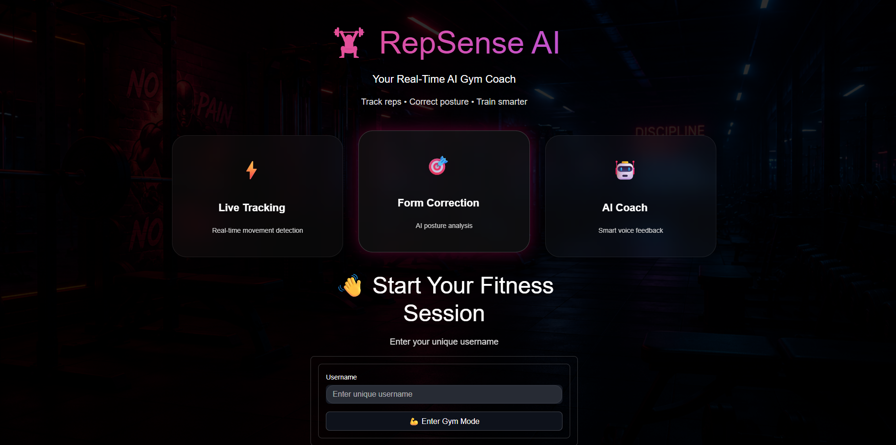
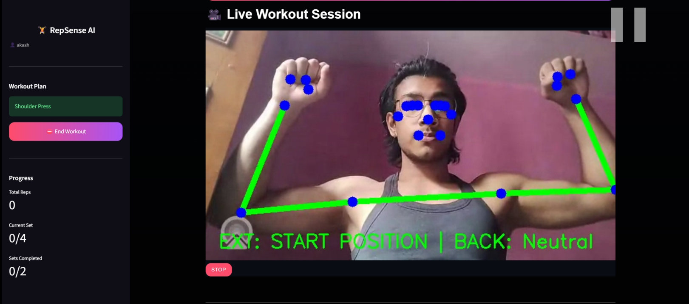
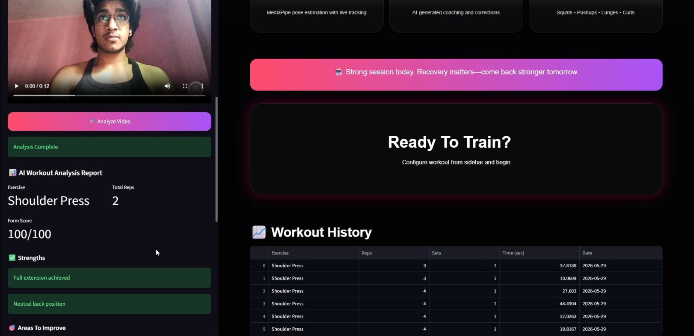

# 🏋️ RepSense AI

### Your Real-Time AI Gym Coach

RepSense AI is an AI-powered fitness coaching platform that provides real-time exercise tracking, rep counting, posture analysis, form correction, voice coaching, workout history management, and uploaded video analysis.

Built using Computer Vision, MediaPipe Pose Estimation, Streamlit, and AI-powered coaching, RepSense AI helps users train smarter by analyzing movement quality and providing actionable feedback.

---

## 🚀 Features

### 🎥 Real-Time Exercise Tracking

- Live webcam-based workout monitoring
- Real-time pose estimation using MediaPipe
- Exercise-specific movement tracking
- Instant visual feedback

### 🔢 Intelligent Rep Counting

- Automatic repetition counting
- Set tracking
- Workout completion detection
- Exercise-specific counting logic

### 🧠 AI Form Analysis

- Posture evaluation
- Joint angle analysis
- Form correction detection
- Exercise-specific biomechanical checks

### 🎙️ AI Voice Coach

- Motivational workout coaching
- Real-time form correction prompts
- Set completion notifications
- Workout completion feedback

### 📁 Upload Video Analysis

- Upload pre-recorded workout videos
- Analyze exercise performance
- Rep counting from uploaded videos
- Form evaluation and feedback

### 📊 Workout Analysis Reports

- Total repetitions
- Form quality assessment
- Strength highlights
- Areas for improvement
- Overall form score

### 📈 Progress Tracking

- Total reps completed
- Current set progress
- Sets completed
- Session monitoring

### 🗄️ Workout History

- Persistent workout storage
- Session tracking
- Exercise logs
- Historical workout records

---

## 🛠️ Tech Stack

### Frontend

- Streamlit
- Custom CSS
- Responsive UI Design

### Computer Vision

- OpenCV
- MediaPipe Pose Landmarker
- NumPy

### AI & Coaching

- Groq API
- Custom Coaching Pipeline
- Text-to-Speech Integration

### Backend

- Python
- SQLite Database

### Video Processing

- OpenCV
- AV
- Streamlit WebRTC

---

## 📌 Supported Exercises

### ✅ Currently Supported

- Squats
- Push-Ups
- Lunges
- Shoulder Press
- Biceps Curls (Dumbbell)

### 🔜 Planned

- Deadlift
- Bench Press
- Lateral Raises
- Pull-Ups
- Plank Analysis

---

## 📂 Project Structure

```bash
RepSense_AI/
│
├── assets/
│
├── core/
│
├── detectors/
│
├── ml_models/
│
├── pages/
│
├── services/
│   ├── auth/
│   ├── coaching/
│   ├── config/
│   ├── persistence/
│   ├── state/
│   ├── tracking/
│   ├── ui/
│   └── vision/
│
├── static/
│
├── .streamlit/
│
├── main.py
├── data.db
└── requirements.txt
```

---

## ⚙️ Installation

### Clone Repository

```bash
git clone https://github.com/itsakki10/RepSence_AI.git
cd RepSence_AI
```

### Create Virtual Environment

```bash
python -m venv .venv
```

### Activate Environment

#### Windows

```bash
.venv\Scripts\activate
```

#### Linux / Mac

```bash
source .venv/bin/activate
```

### Install Dependencies

```bash
pip install -r requirements.txt
```

---

## 🔑 Environment Variables

Create a `.env` file in the root directory:

```env
GROQ_API_KEY=your_groq_api_key_here
```

---

## ▶️ Run the Application

```bash
streamlit run main.py
```

---

## 📷 Application Workflow

### Live Camera Mode

```text
Webcam
   ↓
MediaPipe Pose Detection
   ↓
Exercise Detector
   ↓
Rep Counter
   ↓
Form Analysis
   ↓
AI Coach Feedback
```

### Upload Video Mode

```text
Video Upload
   ↓
OpenCV Processing
   ↓
Pose Detection
   ↓
Exercise Analysis
   ↓
Rep Counting
   ↓
AI Workout Report
```

---

## 🎯 Key Highlights

- Real-time AI-powered fitness coaching
- Live exercise recognition
- Automatic rep counting
- Form correction feedback
- Voice coaching system
- Workout history storage
- Uploaded video analysis
- Modern fitness dashboard
- Modular architecture for future expansion

---

## 📸 Screenshots

Add screenshots inside a `/screenshots` folder and update:

```md





```
<<<<<<< HEAD

---

=======
>>>>>>> 777334866bef3bfdc9700afbe7774e38c9449c3b
## 👨‍💻 Author

**Akash Mehra**
